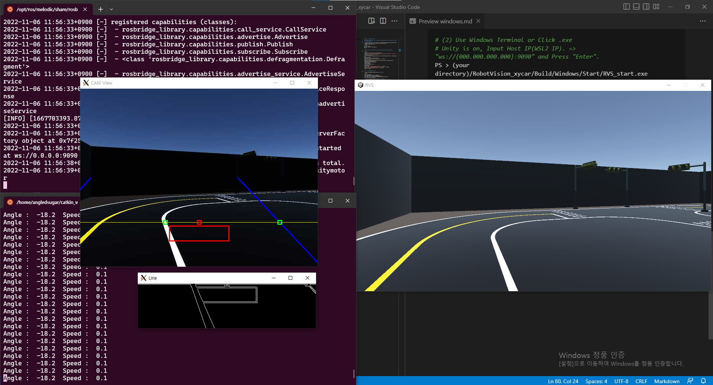

# Ubuntu 18.04


## ROS melodic 설치 [[Link]](http://wiki.ros.org/melodic/Installation/Ubuntu)
 
```bash
$ sudo apt-get update && sudo apt-get upgrade -y
$ sudo sh -c 'echo "deb http://packages.ros.org/ros/ubuntu $(lsb_release -sc) main" > /etc/apt/sources.list.d/ros-latest.list'  
$ sudo apt install curl  
$ curl -s https://raw.githubusercontent.com/ros/rosdistro/master/ros.asc | sudo apt-key add -  
$ sudo apt update  
$ sudo apt install ros-melodic-desktop  
$ echo "source /opt/ros/melodic/setup.bash" >> ~/.bashrc  
$ source ~/.bashrc  
$ sudo apt install python-rosdep python-rosinstall python-rosinstall-generator python-wstool build-essential  
$ sudo apt install python-rosdep  
$ sudo rosdep init  
$ rosdep update  
$ mkdir -p ~/catkin_ws/src  
$ cd ~/xycar_ws/  
$ catkin_make  
$ echo "source ~/xycar_ws/devel/setup.bash" >> ~/.bashrc  
$ echo "export ROS_MASTER_URI=http://localhost:11311 " >> ~/.bashrc  
$ echo "export ROS_HOSTNAME=localhost " >> ~/.bashrc  
$ source ~/.bashrc  
```

## 주행 시뮬레이터 패키지 설치
```bash
$ cd ~/xycar_ws/src  
$ sudo apt update && sudo apt upgrade -y  
$ sudo apt install ros-melodic-rosbridge-server  
$ git clone https://github.com/Angledsugar/RobotVision_xycar.git  
$ cd ~/xycar_ws && catkin_make
```

## 실행 방법   
```bash
# (1) Terminal 1 
$ roslaunch rosbridge_server rosbridge_websocket.launch
```  
```bash  
# (2) Terminal 2
# Unity is on, Input Ubuntu IP(localhost). => "ws://localhost:9090" and Press "Enter".
$ ~/xycar_ws/src/RobotVision_xycar/Build/Linux/Start/RVS_start.x86_64

# If you input right host ip, ros can connect RVS. 
$ ~/xycar_ws/src/RobotVision_xycar/Build/Linux/Xycar/RVS.x86_64

```
```bash
# (3) Terminal 3
$ roslaunch assignment1 driving.launch   
```
