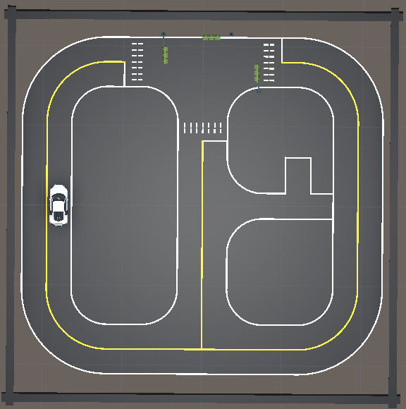
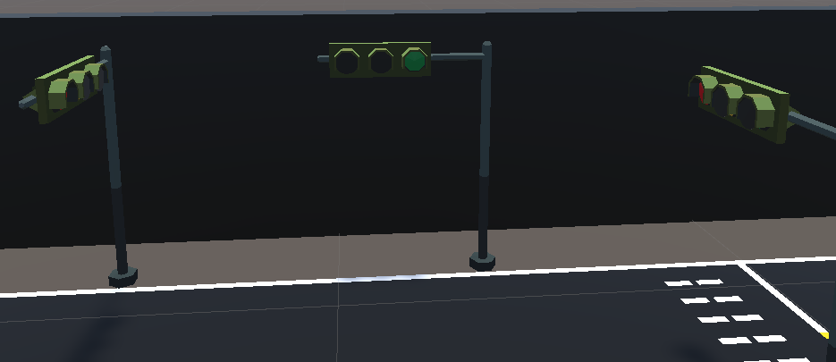
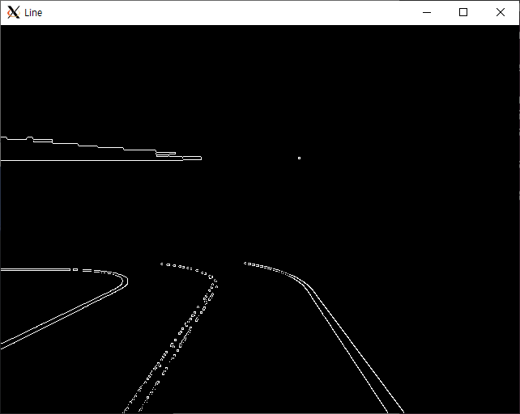
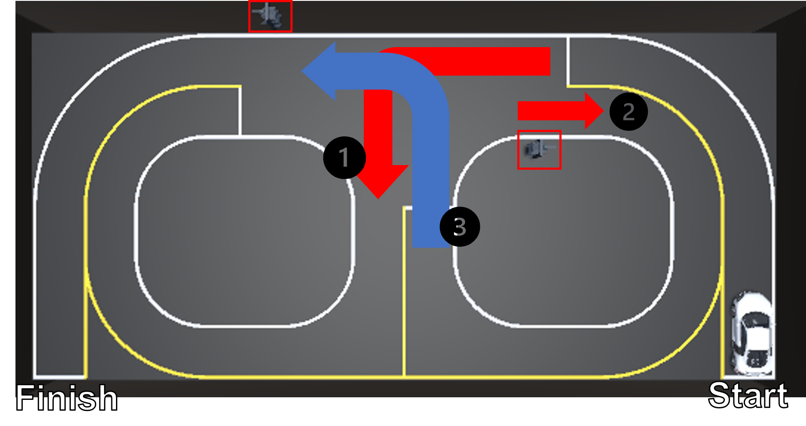
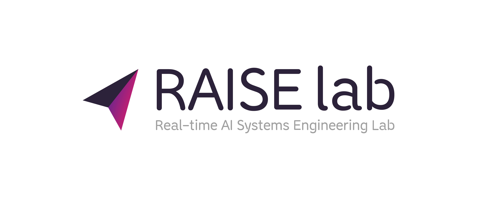

# RobotVision_xycar 
## Robot Vision System - xycar
This lab was produced for the purpose of designing the robot vision system and vision system at Hanyang University ERICA. The robot vision system is a machine vision system using a robot and is a high-speed/fixed-precision, real-time visual sensor system that performs various robot tasks. Using Xytron's Xycar-X model, we learn the robot vision system for autonomous vehicles.  
Please contact Github Issue or class assistant Chanyeok Choi(angledsugar@hanyang.ac.kr) if you have any problems with the installation of the lab.  

  

  

## Getting Started Guide
Nvidia AGX Xavier installed in Xycar is called Single-board computer (SBC). Your Computer is called PC. Data from many sensor installed in Xycar sent to the SBC. If you want see sensor data, you do connect your PC to SBC.  Nvidia AGX Xavier OS is Jetpack 4.2.3 & ROS1 Melodic. 
Recommend PC OS is Ubuntu 18.04 & Windows10 or 11.

[1. Windows 10 + WSL2](./GettingStartedGuide/windows.md)  
[2. Ubuntu 18.04](./GettingStartedGuide/ubuntu.md)   

# Assignment 
**Deadline : 2022.11.08 ~ 2022.12.06**

# Assignment1 : OpenCV로 차선, 신호등 인식하기

<!-- 

 
   -->

If you control the robot right away in the real world, there are many problems. The cost of researching robots is high, but we don't know what problems will arise because the code we wrote doesn't work perfectly at once. To solve this problem, we create a Simulation environment and test the code. [more](./AssignmentGuide/assignment1.md) 

# Assignmnet2 : Sim to Real

   

In Unity simulation, we used Opencv to recognize lines and traffic lights for Xycar autonomous driving. Can we use the simulation method in the real world as it is? Identify and solve the gap in Sim to Real. [more](./AssignmentGuide/assignment2.md)   

# Reference
1. [ENet: A Deep Neural Network Architecture for Real-Time Semantic Segmentation](https://arxiv.org/pdf/1606.02147.pdf)

# Author
**Chanyeok Choi**    
**Hojoon Choi**   
**Yuhyun Kim**    
**Youngmoon Lee***   
  

