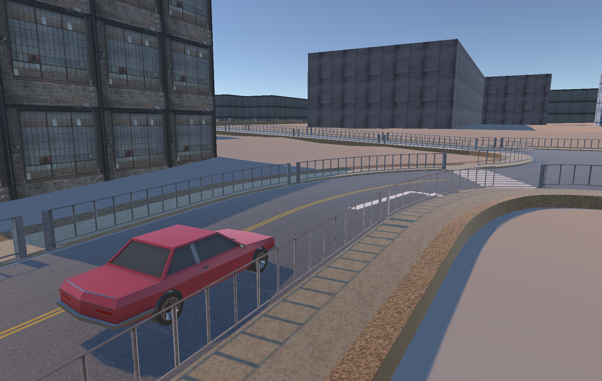
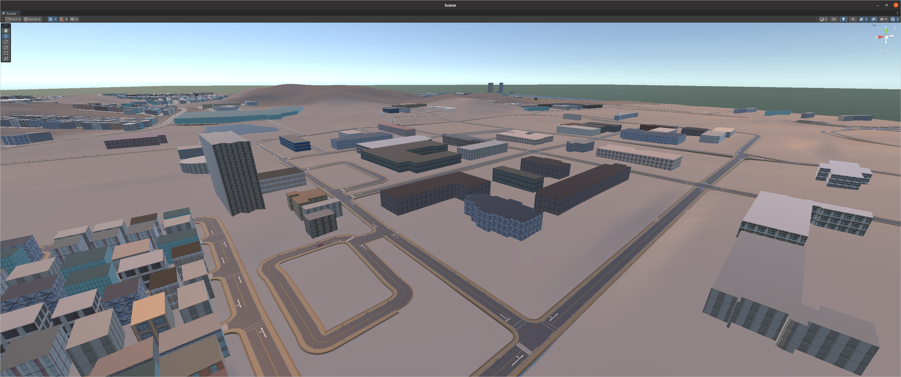
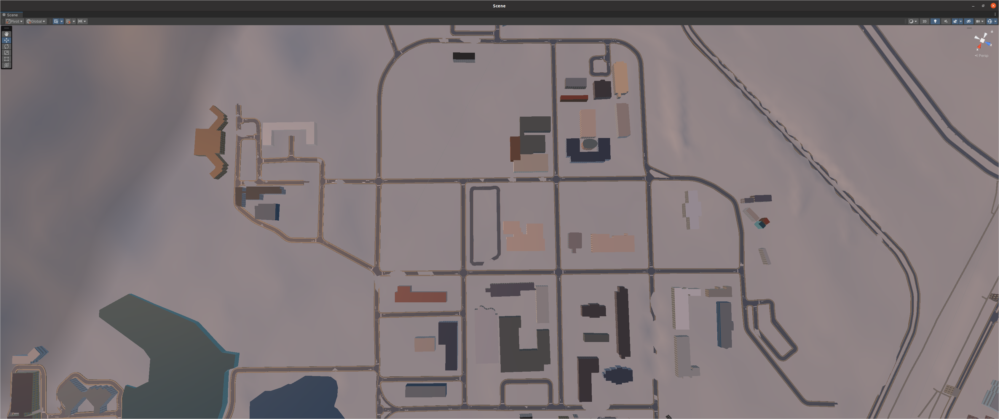

# RobotVisionSystem

    
      

This project was produced for the purpose of designing the robot vision system and vision system at Hanyang University ERICA. The robot vision system is a machine vision system using a robot and is a high-speed/fixed-precision, real-time visual sensor system that performs various robot tasks. Using Xytron's Xycar-X model, we learn the robot vision system for autonomous vehicles.

# Getting Started
## Installation

## Example

# Assignment
## Assignment 1
 

## Assignment 2

# Issue
Please contact Github Issue or class assistant [Chanyeok Choi](angledsugar@hanyang.ac.kr) if you have any problems with the installation of the project.  

# Author
**Chanyeok Choi**    
**Youngmoon Lee***