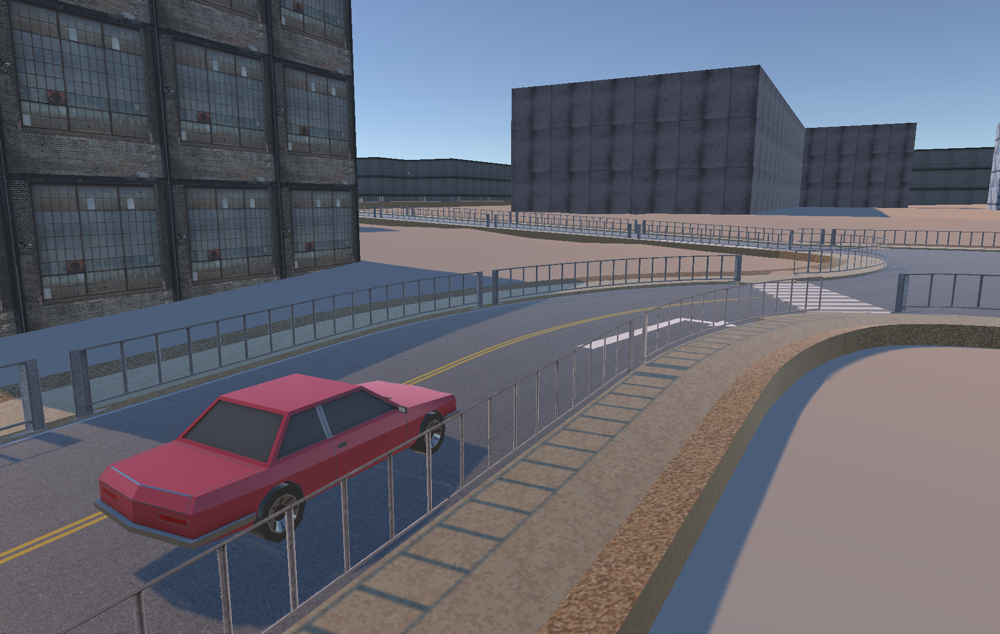
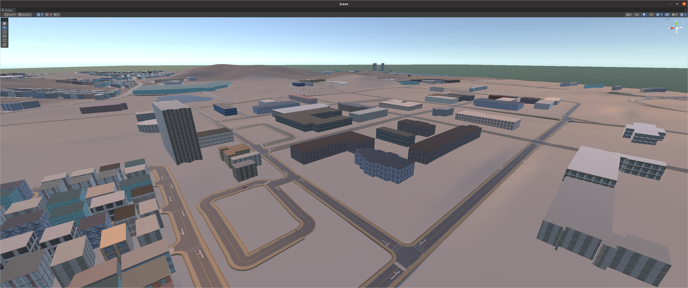
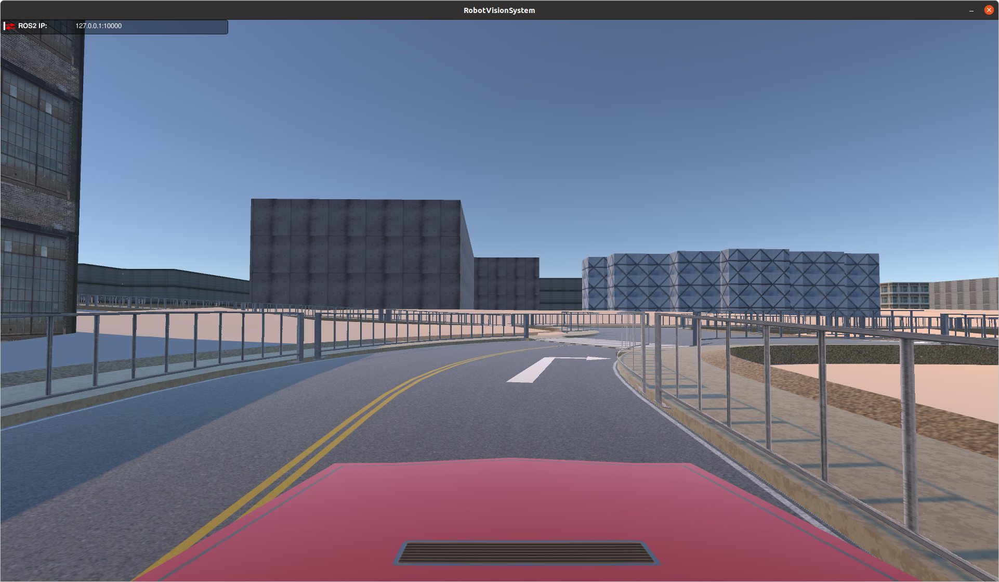
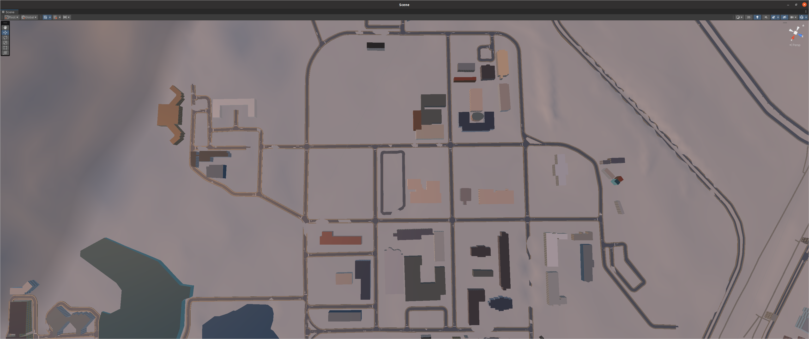
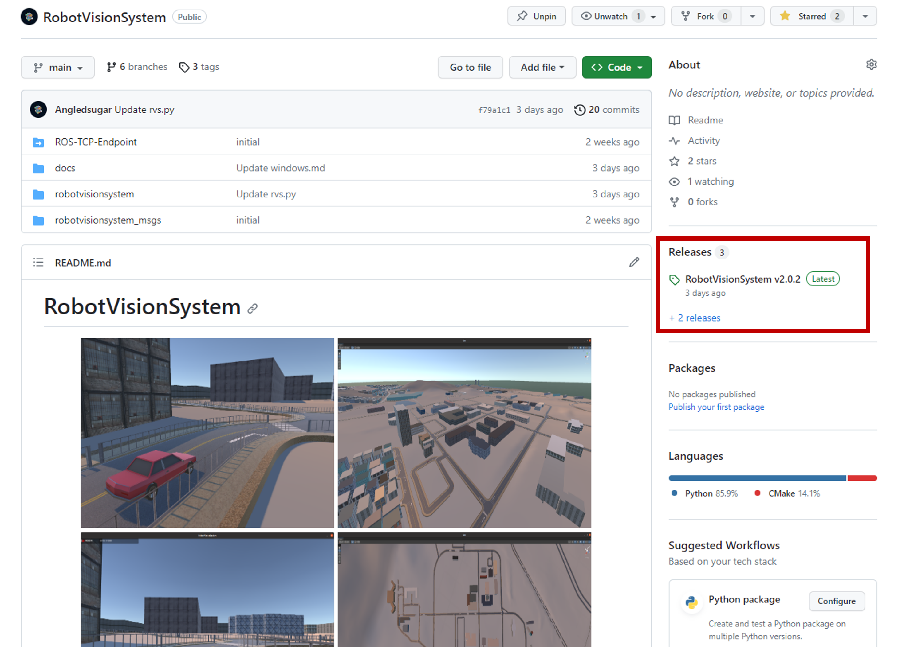
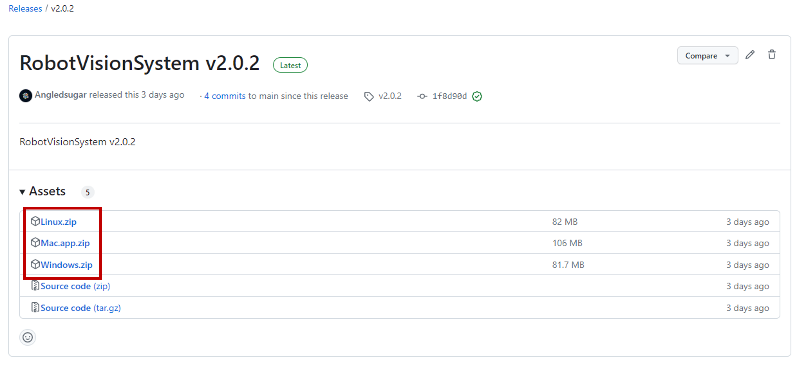

# RobotVisionSystem
<p align="center">
    
     
    
     
</p>
This project was produced for the purpose of designing the robot vision system and vision system at Hanyang University ERICA. The robot vision system is a machine vision system using a robot and is a high-speed/fixed-precision, real-time visual sensor system that performs various robot tasks. Using Xytron's Xycar-X model, we learn the robot vision system for autonomous vehicles.

# Getting Started
## Installation
Click [here](https://github.com/Angledsugar/RobotVisionSystem/releases) to get started with the latest release of robotvisionsystem. And download the version for your operating system. Recommended OS is **Ubuntu 20.04**.

<p align="center">
    
    
</p>

1. [Linux](./linux.md)
2. [Windows](./windows.md)
3. [Mac](./mac.md)

## Example
```bash
# robotvisionsystem/robotvisionsystem/rvs.py
def rvs(self):
    msg = Motor()
    if 0 < self.i <= 1:    
        msg.steer = 0.0
        msg.motorspeed = 1.0
  
    elif 1 < self.i <= 5:    
        msg.steer = 30.0
        msg.motorspeed = 1.0

    elif 5 < self.i <= 10:
        msg.steer = -30.0
        msg.motorspeed = 5.0

    self.pub_motor.publish(msg)
    self.get_logger().info("Steer : %s MotorSpeed : %s Break : %s" % (msg.steer, msg.motorspeed, msg.breakbool))
    self.i += 1
```
# Assignment
## Assignment 1
If you control the robot right away in the real world, there are many problems. The cost of researching robots is high, but we don't know what problems will arise because the code we wrote doesn't work perfectly at once. To solve this problem, we create a Simulation environment and test the code.

## Assignment 2

# Issue
Please contact **Github Issue** or class assistant **[Chanyeok Choi](mailto:angledsugar@hanyang.ac.kr)** if you have any problems with the installation of the project.  

# Author
**Chanyeok Choi**   
**Youngmoon Lee***   